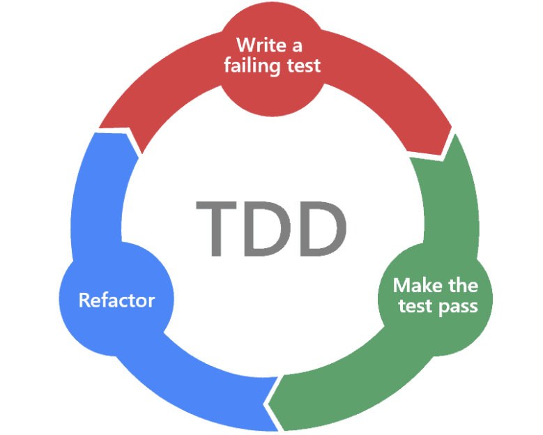

### Part 1 
To start building something, we need to have requirements. Build the following APIs:

```
GET /users

response: 
[{first: 'Zehava', last: 'Ben'},{first: 'Kobi', last: 'Oz'}]
```

```
POST /users

body: 
{first: 'Yuval', last: 'Levi'}
```

**Assumptions**

- We already have a typescript express server template with sequelize.
- Skip tests with containers (for this session, to get fast feedback). 

[](https://mermaid-js.github.io/mermaid-live-editor/edit##eyJjb2RlIjoiZ3JhcGggVERcbiAgICBBW0NvbnRyb2xsZXJdIC0tPkJbU2VydmljZV1cbiAgICBCW1NlcnZpY2VdIC0tPkNbUmVwb3NpdG9yeV1cbiAgIiwibWVybWFpZCI6IntcbiAgXCJ0aGVtZVwiOiBcImRlZmF1bHRcIlxufSIsInVwZGF0ZUVkaXRvciI6dHJ1ZSwiYXV0b1N5bmMiOnRydWUsInVwZGF0ZURpYWdyYW0iOmZhbHNlfQ)

**Terminology** (for this session)

- Unit test - test only one layer (controller, service or repo).
- Integration test - test more than one layer.

**Where to start?**

We know that we start with test because we are in TDD session :) but what scope/level to test? 

Options to start with:
- Start with testing each layer. Meaning to imagine the input/output and how the layers will integrate. 
- Drive the code from the facts. Use the HTTP calls given in the requirements. HTTP can help us build the controllers, but we can emerge all layers by avoiding mocks.

Some hints:
- docker run --name test-mysql -p 3307:3306 -e MYSQL_ROOT_PASSWORD=pswd -d mysql:8.0.15